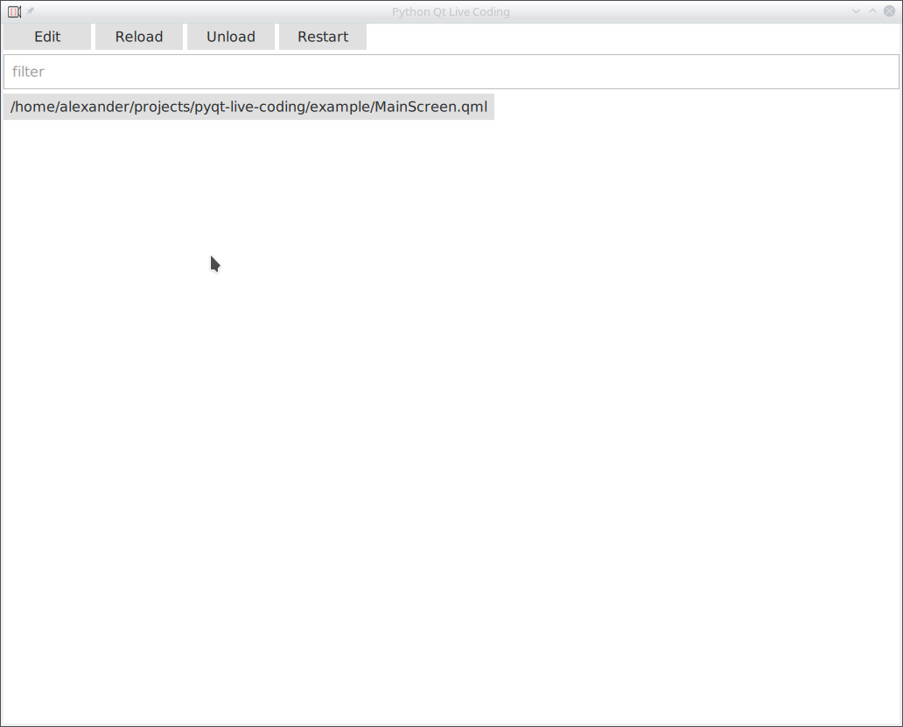
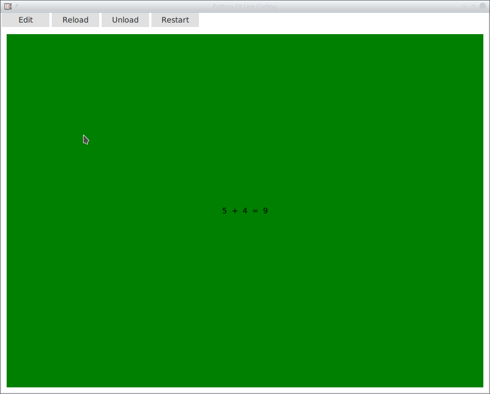

# Live Coding Environment for Python, Qt and QML
[](https://badge.fury.io/py/python-qt-live-coding)
[](https://travis-ci.org/machinekoder/python-qt-live-coding)
[](https://github.com/machinekoder/speed-friending-matcher/blob/master/LICENSE)


This project provides a live coding environment for Python and Qt.

At the moment this project only support PyQt as Qt for Python bindings. 
However, PySide (or Python for Qt) support will be added when available.

## Install

To install the live coding environment run:

```bash
python setup.py install
```

## Use

The live coding environment comes with a live runner which enables your to live
code Qt GUIs quickly.

Run following to test drive the example:

```bash
python_qt_live_coding examples
```

Your will instantly see the example project in the live runner.



Now you can either select the `MainScreen.qml` file or type `MainScreen` in the filter.

When you type, the file will be automatically selected.

When loaded you will see following.



This is the example GUI inside the live runner.

Now press the `Edit` button. Your favorite text editor should open promptly.

Edit the code inside the editor und you will see the GUI updates instantly when you save the document.

## Python QML module support

The live coding environment has built in support for Python QML modules.

The idea is to place QML and Python code in the same directory, similar to how you would create a Qt/C++ application.
Additionally, with Python we have the advantage of being able to discover modules automatically.

For this purpose add `register_qml_types` function to the `__init__.py` of your Python QML module. 
See the example in [example/module/\_\_init__.py](./example/module/__init__.py).

However, so far automatic reloading of Python code is not support. 
When you work on a Python module please use the `Restart` button which restarts the live coding application instead.
